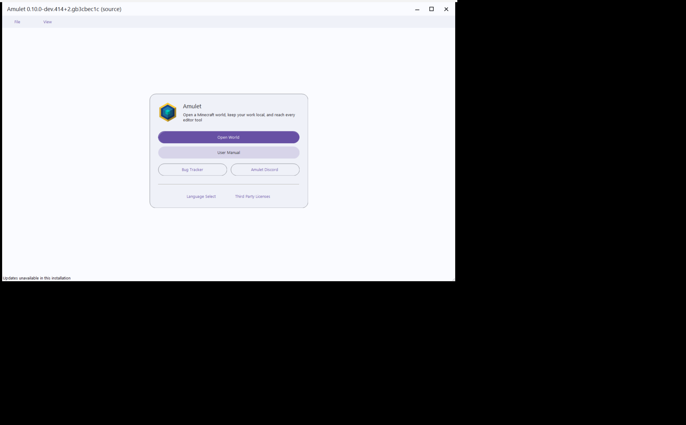

<div align="center">


# Amulet Map Editor

**A free, open-source Minecraft world editor and converter for Java and Bedrock worlds.**

[](https://github.com/Ding-Ding-Projects/material-minecraft-map-editor/actions/workflows/build-windows.yml)
[](https://github.com/Ding-Ding-Projects/material-minecraft-map-editor/actions/workflows/unittests.yml)
[](setup.cfg)
[](ROADMAP.md)

[Download verified Windows build 0.10.0-dev.414](https://github.com/Ding-Ding-Projects/material-minecraft-map-editor/releases/download/0.10.0-dev.414/Setup.exe)
· [All releases](https://github.com/Ding-Ding-Projects/material-minecraft-map-editor/releases)
· [Project site source](docs/site/index.html)
· [Feature documentation](docs/features/README.md)
· [Report an issue](https://github.com/Ding-Ding-Projects/material-minecraft-map-editor/issues)

</div>

**Contents:** [one-click builds](#one-click-windows-builds) ·
[the interface](#amulet-studio) ·
[capabilities](#what-amulet-can-do) ·
[screenshots](#screenshots) ·
[Windows install and updates](#install-and-update-on-windows) ·
[development](#development-and-contribution) ·
[verification](#verification-status)

Amulet opens Minecraft worlds outside the game so that you can inspect terrain,
select precise regions, move builds between worlds, run block and biome
operations, import or export structures, delete or regenerate chunks, and
convert world data. The package metadata supports Java Edition 1.12 and newer
and Bedrock Edition 1.7 and newer.

> [!CAUTION]
> Back up every world before editing it. Close the world in Minecraft and any
> other editor first. Conversion can overwrite chunks in the destination world.

## One-click Windows builds

From a fresh Windows checkout, `build.bat /s` checks for the Python launcher and, when it is absent, installs user-scoped Python 3.11 through canonical `winget` when available or the official python.org installer when `winget` is missing. It then bootstraps the declared dependencies and installs the editable package without prompts. `build-installer.bat /s` runs that bootstrap, builds `installer/Amulet.spec`, and invokes the same unsigned Squirrel.Windows packaging path used by CI. Omit `/s` for phase output and the final launch choice. Neither script signs, publishes, tags, or creates a release; both report an exact failure if the canonical bootstrap route itself is unavailable.

The one-click paths were exercised locally on Windows from this checkout: `build.bat /s` exited 0 after resolving the declared runtime dependencies, and `build-installer.bat /s` produced `Setup.exe`, `RELEASES`, and `Amulet-0.10.0-dev-local-full.nupkg` under `installer/dist/squirrel/Amulet-0.10.0-dev-local-Windows-x64`. The installer output is unsigned by design; the script prints SHA-256 digests for all three artifacts. This is local packaging evidence, not a replacement for the immutable CI release record.

## Amulet Studio

The interface is a **project workspace** built from exactly two views, which are
swapped rather than stacked.

**Backstage** is what the application opens on: a template gallery for starting
a project, a searchable and filterable table of recent projects and worlds, an
Open page listing detected Minecraft worlds beside a browse path, project info,
conversion, and an **All surfaces** index of every window, panel, and tool the
application can open.

**Workspace** is where a project is edited: a seventeen-tab ribbon (Home, Tools,
Selection, Operations, Structures, Chunks, Terrain, Build, Entities, Data,
Analyze, Redstone, Worldgen, View, Panels, Extend, Automate), a breadcrumb
context bar carrying the head revision, a navigator for dimensions and selection
boxes, the viewport with its overlays, a tabbed properties pane, and a status
bar.

This replaced the earlier single start card plus tool strip. The world notebook
that shell used still exists — it owns world loading and per-page unsaved-work
protection — and is handed to the workspace viewport once a world is open, so
the real renderer draws inside the new shell rather than beside it. A build
whose Studio package cannot be constructed falls back to that notebook rather
than opening an empty window.

<details>
<summary><strong>How the surfaces are built, and how to add one</strong></summary>

Most windows are **data**. A surface is described by a spec — an eyebrow, a
title, a width, an introduction, an ordered list of sections, and footer actions
— and one renderer turns that into real controls. There are sixteen section
kinds: `search`, `fields`, `selects`, `list`, `keys`, `tree`, `chips`, `checks`,
`ranges`, `swatches`, `progress`, `keygate`, `code`, `note`, `commits`,
`texture`.

Adding a window is one spec entry plus one line in the surface index. It then
appears in the backstage's **All surfaces** page, in the command palette, and as
a valid target for a ribbon tile or a context-menu row, with no new markup.

Two surfaces are hand-built because the renderer cannot express them: the **NBT
editor** (three panes, with a control matched to each of the twelve tag types)
and the **Memory Console** (a thirteen-view rail, a card grid, and a two-pane
documentation reader).

Read [`docs/features/spec-renderer/README.md`](docs/features/spec-renderer/README.md)
for the full contract.

</details>

<details>
<summary><strong>Cross-cutting behaviour every surface shares</strong></summary>

- **Every search field** is the same field: plain text by default, a regex
  opt-in, a `.*` builder anchored beside it, and an honest feedback line. An
  invalid pattern is reported and matches nothing rather than being silently
  ignored.
- **Every dropdown is searchable**, and every right-click menu is searchable and
  shows each item's real keyboard shortcut.
- **`Ctrl+Shift+F`** opens the command palette over every surface, command, and
  setting, reading the same registries the rest of the shell reads.
- **Every project owns an isolated Git repository** beside its world data, which
  is what makes undo depth unlimited. Restoring writes a *new* revision rather
  than rewinding, so the state you restored from stays undoable.
- **Anything irreversible passes a two-key gate** with a full-range slider and
  an always-available emergency exit.
- **Texture previews are generated placeholder swatches and say so.** A real
  texture comes from a loaded Minecraft installation, a resource pack, or a PNG
  dropped on the slot.
- **Nothing reaches the network at runtime.** Fonts fall back through a local
  candidate list; there is no sign-in, telemetry, or cloud storage.
- **Nobody ever pays.** No purchase, licence, subscription, trial, or unlock,
  and no prompt asking for one.

</details>

<details>
<summary><strong>Material Design 3 and global-interface foundations</strong></summary>

The `0.10` source line is being modernized without pretending that the migration
is already complete. The foundations currently checked into this repository
include:

- the Amulet Studio token layer — fourteen colour roles in a light and a dark
  palette, three density heights (32, 36, 44), the spacing and radius scales,
  and a local-only font fallback chain;
- the shared wxPython Material 3 role layer still serving the dialogs that
  predate the Studio, reading the same persisted appearance profile;
- persisted English, playful Hong Kong Cantonese, and bilingual language modes;
- independent English and Cantonese voice-level controls from 1 to 5, plus a
  dialog-emoji preference;
- persisted light, dark, and system themes; compact, comfortable, and spacious
  density; accent color; UI font; and 80–200% UI scaling;
- a wx-independent, versioned named appearance-preset foundation with strict
  JSON export/import plus native Appearance-tab load, save, import, export, and
  staged per-property or appearance-only global reset controls;
- a tabbed native Preferences dialog with searchable settings, a bounded Python
  `re` builder, and a `Ctrl+Shift+F` command palette;
- a shared School-mode presentation lock with a renamed label, salted unlock
  verifier, and native controls that remove inapplicable language settings;
- a persisted notification history with search, bulk dismissal, and Markdown
  export;
- a native scheduled-settings editor and versioned local rule engine for
  language, theme, density, and accent overrides, including priorities,
  weekdays, date ranges, time windows, and deterministic precedence;
- a non-blocking Windows update-status bridge restricted to the project's exact
  immutable HTTPS release route, with explicit unsigned-package warnings;
- a safe external-editor bridge that discovers Visual Studio Code installations,
  persists a validated executable, and opens exported folders as workspace
  roots;
- a bounded startup dim-sum surprise foundation that reads authoritative dish
  names from the public catalog without copying or vendoring photos; and
- a dependency-free Material 3 site shell with tabs, feature and settings
  search, an attached bounded regex builder with flags, sample text, and capture
  feedback, persisted appearance controls, responsive layouts, focus states, and
  reduced-motion support.

These are source and automated-test claims. **No runtime capture of the Amulet
Studio interface exists yet**, so nothing here is pixel evidence for it.

Relevant source and contracts:

- [`amulet_map_editor/api/studio/`](amulet_map_editor/api/studio/)
- [`docs/features/project-shell/README.md`](docs/features/project-shell/README.md)
- [`docs/features/spec-renderer/README.md`](docs/features/spec-renderer/README.md)
- [`amulet_map_editor/api/wx/material3.py`](amulet_map_editor/api/wx/material3.py)
- [`docs/features/material-shell/README.md`](docs/features/material-shell/README.md)
- [`installer/PACKAGING.md`](installer/PACKAGING.md)
- [`docs/site/README.md`](docs/site/README.md)

</details>

## Start here

- **Install:** use the verified [unsigned Windows 0.10.0-dev.414 `Setup.exe`](https://github.com/Ding-Ding-Projects/material-minecraft-map-editor/releases/download/0.10.0-dev.414/Setup.exe), [RELEASES feed](https://github.com/Ding-Ding-Projects/material-minecraft-map-editor/releases/download/0.10.0-dev.414/RELEASES), or [full Squirrel package](https://github.com/Ding-Ding-Projects/material-minecraft-map-editor/releases/download/0.10.0-dev.414/Amulet-0.10.0-dev414-full.nupkg). These immutable assets target `f95695f7cbadecd3272370a1fa694e9b601ab124`.
- **Learn the interface:** start with [project shell](docs/features/project-shell/README.md), then [backstage](docs/features/backstage/README.md) and [ribbon](docs/features/ribbon/README.md).
- **Learn the workflows:** follow the [open-world guide](amulet_map_editor/readme.md), [3D editor guide](amulet_map_editor/programs/edit/readme.md), and [conversion guide](amulet_map_editor/programs/convert/readme.md).
- **Explore the site:** open the dependency-free [Material 3 site source](docs/site/index.html), or visit the [official Amulet website](https://www.amuletmc.com/).
- **Track the modernization:** see the factual [roadmap](ROADMAP.md) and [handoff](HANDOFF.md).
- **Contribute:** read [Development and contribution](#development-and-contribution), then use [Issues](https://github.com/Ding-Ding-Projects/material-minecraft-map-editor/issues) or [Discussions](https://github.com/Ding-Ding-Projects/material-minecraft-map-editor/discussions).

## What Amulet can do

| Area | Capabilities in this source tree |
| --- | --- |
| World access | Discover Java and Bedrock worlds, open a world from another folder, keep several projects in the recent table, and switch between dimensions from the navigator. |
| 2D and 3D editing | Navigate rendered terrain, inspect blocks, change projection, and create one or more selection boxes with direct coordinate controls. |
| Selection workflow | Copy, cut, delete, paste, translate, rotate, scale, mirror, and move selected structures. Copied data can move between simultaneously open worlds. |
| Stock operations | Clone, fill, replace, set biome, and waterlog selected regions; the operation framework also supports project-specific Python extensions. |
| Terrain and build | Sculpt, smooth, flatten, erode, noise-fill, repaint, and regenerate terrain; place patterns, stacks and arrays, structures, waypoints, matched nether portals, and a fully specified rail tunnel with its own lighting designer. |
| World data | Browse and edit entities, players, signs, command blocks, game rules, scoreboards, map items and `level.dat`, with a dedicated NBT editor carrying a control matched to each of the twelve tag types. |
| Analysis | Block histograms, chunk inspection, biome maps, relighting, world comparison, validation and repair, measurement, layer slicing, redstone and rail tracing, spawn and light analysis, and worldgen tools. |
| Structure files | Import supported structures and export `.construction`, `.mcstructure`, legacy `.schematic`, and Sponge `.schem` data through format-specific handlers. |
| Chunk tools | Select chunks, delete selected chunks, or delete everything outside the selected area so Minecraft can regenerate it. |
| World conversion | Merge source-world chunks into a chosen destination world through Amulet's format translation layer. Destination chunks at matching coordinates are overwritten. |
| Editing history | Per-project Git-backed history with unlimited undo depth; restoring writes a new revision rather than rewinding. |
| Delivery | Build PyInstaller bundles and produce unsigned Squirrel.Windows `Setup.exe`, `RELEASES`, and full `.nupkg` assets. |

## Screenshots

> [!IMPORTANT]
> **There is no capture of the Amulet Studio interface yet.** Every image below
> shows an earlier build — the pre-Material workflow screenshots and the
> owner-drawn Material shell that the Studio replaced. They are kept because
> they are genuine records of what they show, and they are labelled as such.
> None of them is evidence for the current interface. A capture of the Studio
> needs a real build on a Windows desktop and will be added when one exists.

Every image in this section is a tracked screenshot of the real wxPython app.
They intentionally retain the version visible in the captured window. No mockup
or generated image is presented as runtime evidence.

### Superseded Material shell (2026-08-09)



Captured from exact commit `b3cbec1c4b1035dd0c2ebdc9a545266f49c257ef`
on an isolated hidden Windows desktop with wxPython 4.2.5. The 2250×1395
capture shows the source frame after startup: no acknowledgement or
purchase prompt, no duplicate one-page tab rail, one logo, and M3 action
hierarchy. **This is the shell Amulet Studio replaced**, not the current one.

<details>
<summary><strong>Open six historical pre-Material workflow screenshots</strong></summary>

<table>
  <tr>
    <td width="50%" valign="top">
      <br>
      <strong>Historical pre-Material main menu — 0.6.1.</strong> The entry point for opening a world or help in that build.
    </td>
    <td width="50%" valign="top">
      <br>
      <strong>Historical pre-Material open-world workspace — 0.6.1.</strong> One open world with the About, Convert, and 3D Editor program rail.
    </td>
  </tr>
  <tr>
    <td width="50%" valign="top">
      <br>
      <strong>Historical pre-Material world selection.</strong> Java and Bedrock discovery on the left, recent worlds on the right, and a path to open another folder.
    </td>
    <td width="50%" valign="top">
      <br>
      <strong>Historical pre-Material expanded world browser.</strong> Installed Bedrock worlds are visible alongside recently opened Java and Bedrock worlds.
    </td>
  </tr>
  <tr>
    <td width="50%" valign="top">
      <br>
      <strong>Historical pre-Material world conversion — 0.6.1.</strong> The source world, destination picker, progress area, and Convert action.
    </td>
    <td width="50%" valign="top">
      <br>
      <strong>Historical pre-Material 3D editor — 0.8.9.</strong> Rendered terrain, multi-box selection controls, dimension and coordinates, undo/redo/save, and the editing tool strip.
    </td>
  </tr>
</table>

</details>

<details>
<summary><strong>Open the four earlier wxPython dialog baselines (2026-08-09)</strong></summary>

These captures are from the real source dialogs at commit `d62ae152`, rendered
on a hidden desktop with wxPython 4.2.5. They preserve an earlier migration
boundary. Several of these dialogs are still the real implementation behind
their Studio surface keys, so they remain useful references — but the chrome
around them has changed.

<table>
  <tr>
    <td width="50%"><br><strong>Earlier Preferences · Language tab.</strong> Genuine native baseline; not current shell proof.</td>
    <td width="50%"><br><strong>Earlier Preferences · Appearance tab.</strong> Genuine native baseline; lower controls require scrolling.</td>
  </tr>
  <tr>
    <td width="50%"><br><strong>Earlier notification history.</strong> Genuine rows; the pictured columns predate later sizing work.</td>
    <td width="50%"><br><strong>Earlier main-frame baseline.</strong> Superseded twice: first by the Material shell above, then by Amulet Studio.</td>
  </tr>
</table>

</details>

<details>
<summary><strong>Open the full 0.10.47 editing montage</strong></summary>


This historical pre-Material capture contains four genuine frames showing a 3D terrain selection, paste placement and
transform controls, a block operation over selected boxes, and a top-down chunk
selection. The montage was added to the repository in 2026; the application
title inside the capture identifies the runtime as `0.10.47`.

</details>

<details>
<summary><strong>Screenshot provenance and limitations</strong></summary>

| Asset | Pixels | Repository provenance | Evidence boundary |
| --- | ---: | --- | --- |
| `cover.jpg` | 5120×2760 | Added in 2026 by the upstream README update | Real 0.10.47 montage; not a capture of the current branch. |
| `edit.jpg` | 1920×1030 | Added in 2020 and updated in 2021 | Real 0.8.9 3D editing workflow. |
| `main_menu.jpg` | 541×389 | Added with the 2020 documentation images | Real 0.6.1 main menu. |
| `world_select.jpg` | 1920×1006 | Added with the 2020 documentation images | Real legacy collapsed world browser. |
| `world_select_expand.jpg` | 1920×1026 | Added with the 2020 documentation images | Real legacy expanded world browser. |
| `about.jpg` | 550×435 | Added with the 2020 application guide | Real 0.6.1 open-world workspace. |
| `convert.jpg` | 814×490 | Added with the 2020 program guide | Real 0.6.1 conversion surface. |
| `preferences-runtime-baseline-20260809.png` | 930×720 | Captured 2026-08-09 from commit `d62ae152` on a hidden desktop | Real Preferences Language tab; native wx chrome remains a pre-M3 baseline. |
| `preferences-appearance-runtime-baseline-20260809.png` | 930×720 | Captured 2026-08-09 from commit `d62ae152` on a hidden desktop | Real Appearance tab; lower preset controls require scrolling. |
| `notification-history-runtime-baseline-20260809.png` | 1140×780 | Captured 2026-08-09 from commit `d62ae152` on a hidden desktop | Real notification history with populated rows; column sizing was corrected later. |
| `main-frame-runtime-baseline-20260809.png` | 1500×930 | Captured 2026-08-09 from commit `d7bd3875` on a hidden desktop | Real AmuletUI with the first custom borderless title bar; superseded. |
| `main-frame-material-shell-b3cbec1c-20260809.png` | 2250×1395 | Captured 2026-08-09 from exact commit `b3cbec1c4b1035dd0c2ebdc9a545266f49c257ef` on an isolated hidden desktop | Real owner-drawn Material shell with quiet startup; **superseded by Amulet Studio**. |

The repository does not currently contain an automated desktop screenshot
harness. These captures are therefore documentation artifacts, not a
pixel-regression suite, and none of them shows the current interface. UI
behavior added after the pictured versions must be verified from builds and
tests rather than inferred from these images.

</details>

## Install and update on Windows

### Recommended install

1. Download the verified [`0.10.0-dev.414 Setup.exe`](https://github.com/Ding-Ding-Projects/material-minecraft-map-editor/releases/download/0.10.0-dev.414/Setup.exe), or choose a newer version from [all releases](https://github.com/Ding-Ding-Projects/material-minecraft-map-editor/releases) after checking its exact assets.
2. Read the matching [`0.10.0-dev.414` release notes and asset list](https://github.com/Ding-Ding-Projects/material-minecraft-map-editor/releases/tag/0.10.0-dev.414).
3. Close Minecraft, back up the world you intend to edit, and run the installer.
4. Open the copied world in Amulet and make a small, reviewable change first.

> [!WARNING]
> Windows artifacts from this repository are intentionally **unsigned**. Windows
> may show an Unknown Publisher or SmartScreen warning. The project does not
> claim Authenticode verification; release integrity relies on GitHub's HTTPS
> transport, published asset digests, and the Squirrel `RELEASES` index.

<details>
<summary><strong>Squirrel.Windows release set, and other platforms</strong></summary>

The Windows workflow packages the PyInstaller application into:

- [`Setup.exe`](https://github.com/Ding-Ding-Projects/material-minecraft-map-editor/releases/download/0.10.0-dev.414/Setup.exe) — verified 0.10.0-dev.414 interactive bootstrap installer;
- [`RELEASES`](https://github.com/Ding-Ding-Projects/material-minecraft-map-editor/releases/download/0.10.0-dev.414/RELEASES) — verified 0.10.0-dev.414 Squirrel release index; and
- [`Amulet-0.10.0-dev414-full.nupkg`](https://github.com/Ding-Ding-Projects/material-minecraft-map-editor/releases/download/0.10.0-dev.414/Amulet-0.10.0-dev414-full.nupkg) — verified application payload used by install and update flows.

The release inspected while this README was written was
[`0.10.0-dev.414`](https://github.com/Ding-Ding-Projects/material-minecraft-map-editor/releases/tag/0.10.0-dev.414),
published on 2026-08-09 from `f95695f7cbadecd3272370a1fa694e9b601ab124`
with all three required assets. Later versions should
be evaluated from their own immutable release page rather than assumed to have
the same asset set.

The active delivery path is Windows-only and publishes unsigned
Squirrel.Windows assets. Source code may still be useful on other platforms,
but this repository does not currently present non-Windows installers as
supported release deliverables.

For a development install, use Python 3.11 or newer and follow the steps below.
wxPython, OpenGL, native build dependencies, and the Amulet format stack must be
available for the desktop runtime. A successful source import or unit-test run
does not by itself prove that a graphical session can create and render the wx
window on that machine.

</details>

## First editing workflow

1. **Back up the world.** Work from a copy until you have verified the result in Minecraft.
2. **Close other writers.** Do not leave the same world open in Minecraft or another editor.
3. **Open the project.** From the backstage, pick a detected world, a recent project, or browse to a folder.
4. **Get your bearings.** The navigator shows the dimension and any selection boxes; the status bar shows the head revision and whether there is unsaved work.
5. **Select narrowly.** Start with the smallest useful region and confirm its coordinates and active dimension.
6. **Apply one action.** Use the ribbon tab that owns it, or press `Ctrl+Shift+F` and search for it by name.
7. **Review before saving.** The properties pane's History tab lists what has been applied; restoring writes a new revision, so trying a restore never costs you the state you restored from.
8. **Close Amulet before Minecraft.** Reopen the edited copy in the game and inspect the affected area.

## Development and contribution

This repository follows the `0.10` development line. It is derived from the
[upstream Amulet Map Editor](https://github.com/Amulet-Team/Amulet-Map-Editor)
and carries additional Material 3, preferences, site, update, and delivery work.

### Local checkout

```powershell
git clone https://github.com/Ding-Ding-Projects/material-minecraft-map-editor.git
Set-Location material-minecraft-map-editor
py -3.11 -m venv .venv
.\.venv\Scripts\Activate.ps1
python -m pip install --upgrade pip
python -m pip install -e ".[dev]"
```

On macOS or Linux, activate with `source .venv/bin/activate`. Resolve native
dependencies from the project metadata and your platform's canonical package
source; do not commit a virtual environment or generated build tree.

### Local checks

```powershell
py -3 -m pytest tests -q
python -m black --check --diff .
python scripts/count_lines.py
```

The interface's data layer — the surface index, the command registry, all the
surface descriptions, the shared search state, the NBT model, and the Memory
Console's content — imports without wxPython, so most of the suite runs on a
machine with no display. The handful of checks that genuinely need wx skip with
a stated reason rather than passing silently.

<details>
<summary><strong>The line counter, and what its rows mean</strong></summary>

The committed line counter is the release source of truth. It counts tracked,
line-oriented text and separates source, tests, styles/markup, generated text,
and deliberately excluded text. `project-total` is the three hand-written
project rows; `repository-grand-total` adds the generated and excluded rows.
Each row reports total/nonblank lines plus surviving `git blame` attribution as
agent, person, or unattributed, and the script fails if that arithmetic drifts.
Binary assets are not line-counted. Dependency/build directories and lockfiles
are excluded explicitly instead of disappearing into an unexplained total.

Always run the committed script rather than re-deriving a count by hand: an
ad-hoc sweep silently drops whatever matches none of its patterns, which is the
one misrepresentation the separated rows exist to prevent.

</details>

<details>
<summary><strong>Regenerating the documentation bundle and the changelog catalog</strong></summary>

Two resources in the package are generated from the repository and must be
rebuilt when their sources change:

```powershell
python scripts/build_docs_bundle.py
python scripts/generate_changelog.py
```

The first rebuilds the offline documentation bundle from every
`docs/features/*/README.md`; a stale bundle fails `tests/test_docs_browser.py`
by design, so an article added without regenerating cannot ship missing from the
in-app browser. The second rebuilds the changelog catalog from the reachable
tags, and the test session regenerates it automatically when the checkout has
moved on.

</details>

### Preview the documentation site

```powershell
python -m http.server 8000 --directory docs/site
```

Open `http://localhost:8000`. The site is plain HTML, CSS, and JavaScript with
no CDN, analytics, or third-party runtime assets. See
[`docs/site/README.md`](docs/site/README.md) for the owner-controlled hosting
contract.

<details>
<summary><strong>Build the Windows package by hand</strong></summary>

```powershell
python -m pip install build "pyinstaller~=6.18"
python -m build
python -m pip install dist/amulet_map_editor-*.whl --upgrade
python -m PyInstaller -y --distpath ./installer/dist installer/Amulet.spec
./installer/build-squirrel.ps1 -Version 0.10.0 -Architecture x64
```

The packaging script downloads pinned NuGet and Squirrel.Windows inputs, checks
the NuGet SHA-256, produces `Setup.exe`, `RELEASES`, and a full `.nupkg`, and
fails if an executable or DLL is signed. CI supplies a prior `RELEASES` and
full package only as a validated pair from the nearest semantically older
release in the same explicit channel. When supplied, the script requires and
uploads a verified current delta, while the client-facing feed advertises only
the current full package until a three-version installed-client update proof
passes. GitHub SHA-256 asset digests are checked when available. Read
[`installer/PACKAGING.md`](installer/PACKAGING.md) before changing this path.

Prefer `build.bat` and `build-installer.bat` for an ordinary build: they are the
paths a fresh machine takes, and using them is also what keeps them working.

</details>

### Contribution checklist

- Keep changes focused and preserve unrelated work.
- Add or update tests for behavior changes; run the narrow tests and the full
  `py -3 -m pytest tests -q` run where feasible.
- When you add a Studio surface, add its spec, its index entry, and its line in
  the hand-written test census in `tests/test_studio_surface_index.py`. When you
  add a search field, add it to `tests/test_studio_regex_builder_coverage.py`.
  Those lists exist so a disappearance fails rather than passing quietly;
  deleting an entry to make the suite green defeats the point.
- Update the relevant feature article under [`docs/features/`](docs/features/README.md),
  the [roadmap](ROADMAP.md), and the [handoff](HANDOFF.md) when behavior or
  verification state changes, and regenerate the documentation bundle.
- Keep screenshot captions factual: identify the captured version and never use
  a design mockup as runtime proof.
- Distinguish source inspection, automated tests, package creation, graphical
  runtime verification, and published release evidence in pull requests.
- Use [Issues](https://github.com/Ding-Ding-Projects/material-minecraft-map-editor/issues)
  for actionable defects or features and [Discussions](https://github.com/Ding-Ding-Projects/material-minecraft-map-editor/discussions)
  for design or workflow conversations.

## Verification status

| Evidence | Current status at this README revision |
| --- | --- |
| Amulet Studio interface | Source and automated-test claims only. The surface index, the spec registry, the ribbon definition, the search behaviour, the token values, the NBT model, the Memory Console content, and the accessibility contract are covered by tests; **no runtime capture of the interface exists**. |
| Tracked desktop captures | Twelve genuine images inspected: seven historical workflow captures, four earlier wxPython runtime baselines, and one exact-commit Material shell capture. All predate Amulet Studio. |
| Preference and regex behavior | Covered by repository unit tests, including bounded persistence, plain/regex matching, invalid patterns, and capture groups. |
| Scheduled-settings behavior | Covered by model and UI-contract tests for persistence, validation, precedence, weekday/date/time boundaries, reordering, and bilingual UI strings. |
| Squirrel update bridge | Covered by wx-independent tests for canonical build/manual/release tag publication, explicit-channel discovery across five bounded inventory pages, one shared check deadline, exact route/status/content validation on every page, official progress/JSON command parsing with bounded stdout and stderr, strict CRLF/LF/CR records, exact post-stage version proof within one 900-second apply-and-check deadline, immediate-layout updater discovery, and the guarded process-start-and-wait restart transaction. |
| Windows release | The inspected `0.10.0-dev.414` release is non-draft and contains `Setup.exe`, `RELEASES`, and `Amulet-0.10.0-dev414-full.nupkg`. |
| Live project-site deployment | The site source is published from `docs/site/`; a verified owner-hosted URL of its own is not claimed here. |

## Project links

- [Material modernization repository](https://github.com/Ding-Ding-Projects/material-minecraft-map-editor)
- [Latest release](https://github.com/Ding-Ding-Projects/material-minecraft-map-editor/releases/latest)
- [Build workflows](https://github.com/Ding-Ding-Projects/material-minecraft-map-editor/actions)
- [Material 3 site source](docs/site/index.html)
- [Feature documentation](docs/features/README.md)
- [Desktop documentation](amulet_map_editor/readme.md)
- [Roadmap](ROADMAP.md)
- [Handoff](HANDOFF.md)
- [Upstream Amulet Map Editor](https://github.com/Amulet-Team/Amulet-Map-Editor)
- [Official Amulet website](https://www.amuletmc.com/)

<details>
<summary><strong>Repository-local working agreement</strong></summary>

This repository carries a sanitized mirror of its shared working agreement in
[`AGENTS.md`](AGENTS.md). In short: preserve user work, keep changes reversible,
apply accessible Material Design 3 patterns consistently, keep documentation
and CI claims truthful, distinguish static checks from actual runtime and
release evidence, and never expose credentials. The canonical shared agreement,
repository-local rules, and higher-priority safety requirements take precedence
over this summary.

</details>
