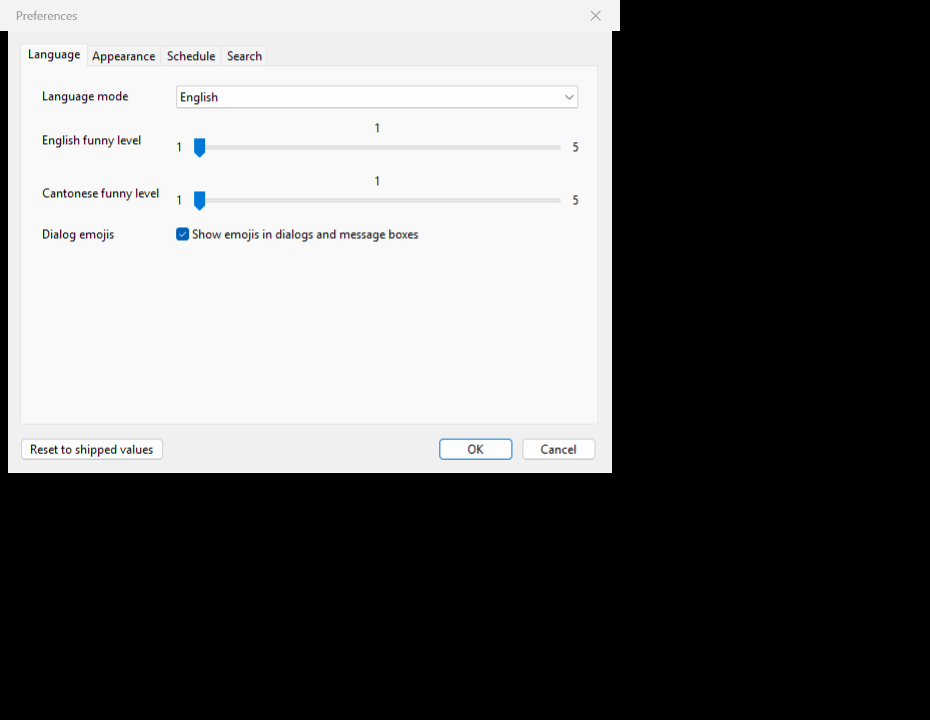
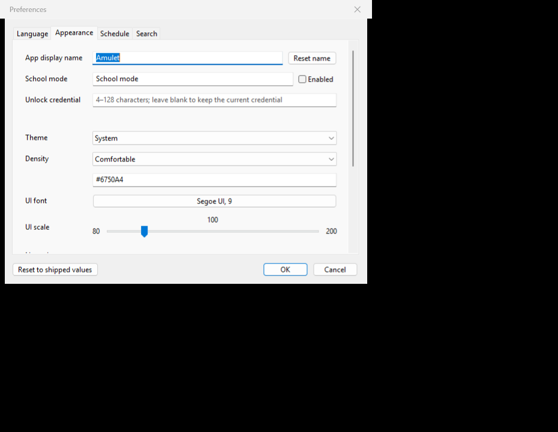
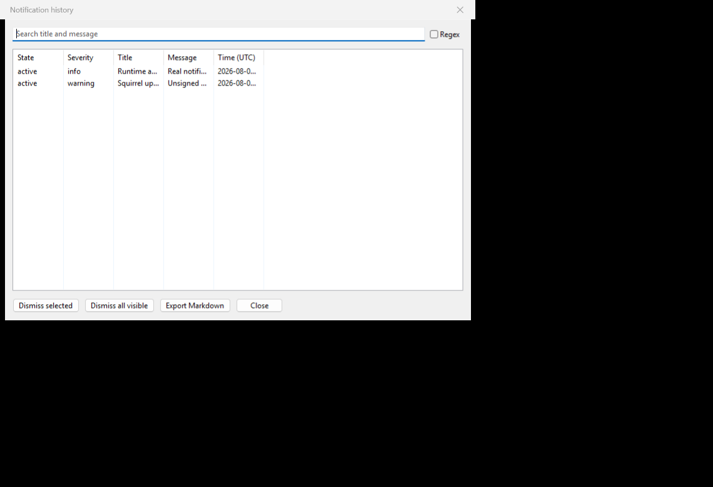
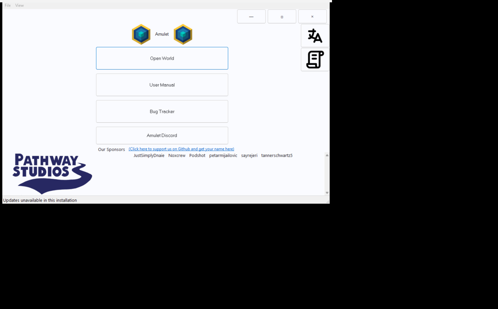

<div align="center">


# Amulet Map Editor

**A free, open-source Minecraft world editor and converter for Java and Bedrock worlds.**

[](https://github.com/Ding-Ding-Projects/material-minecraft-map-editor/actions/workflows/build-windows.yml)
[](https://github.com/Ding-Ding-Projects/material-minecraft-map-editor/actions/workflows/unittests.yml)
[](setup.cfg)
[](ROADMAP.md)

[Download verified Windows build 0.10.55](https://github.com/Ding-Ding-Projects/material-minecraft-map-editor/releases/download/0.10.55/Setup.exe)
· [All releases](https://github.com/Ding-Ding-Projects/material-minecraft-map-editor/releases)
· [Project site source](docs/site/index.html)
· [Documentation](amulet_map_editor/readme.md)
· [Report an issue](https://github.com/Ding-Ding-Projects/material-minecraft-map-editor/issues)

</div>

## One-click Windows builds

From a fresh Windows checkout, `build.bat /s` checks for the Python launcher and, when it is absent, installs user-scoped Python 3.11 through canonical `winget` when available or the official python.org installer when `winget` is missing. It then bootstraps the declared dependencies and installs the editable package without prompts. `build-installer.bat /s` runs that bootstrap, builds `installer/Amulet.spec`, and invokes the same unsigned Squirrel.Windows packaging path used by CI. Omit `/s` for phase output and the final launch choice. Neither script signs, publishes, tags, or creates a release; both report an exact failure if the canonical bootstrap route itself is unavailable.

The one-click paths were exercised locally on Windows from this checkout: `build.bat /s` exited 0 after resolving the declared runtime dependencies, and `build-installer.bat /s` produced `Setup.exe`, `RELEASES`, and `Amulet-0.10.0-dev-local-full.nupkg` under `installer/dist/squirrel/Amulet-0.10.0-dev-local-Windows-x64`. The installer output is unsigned by design; the script prints SHA-256 digests for all three artifacts. This is local packaging evidence, not a replacement for the immutable CI release record.


Amulet opens Minecraft worlds outside the game so that you can inspect terrain,
select precise regions, move builds between worlds, run block and biome
operations, import or export structures, delete or regenerate chunks, and
convert world data. The package metadata supports Java Edition 1.12 and newer
and Bedrock Edition 1.7 and newer.

> [!CAUTION]
> Back up every world before editing it. Close the world in Minecraft and any
> other editor first. Conversion can overwrite chunks in the destination world.

## Start here

- **Install:** use the verified [unsigned Windows 0.10.55 `Setup.exe`](https://github.com/Ding-Ding-Projects/material-minecraft-map-editor/releases/download/0.10.55/Setup.exe), [RELEASES feed](https://github.com/Ding-Ding-Projects/material-minecraft-map-editor/releases/download/0.10.55/RELEASES), or [full Squirrel package](https://github.com/Ding-Ding-Projects/material-minecraft-map-editor/releases/download/0.10.55/Amulet-0.10.55-full.nupkg). These immutable assets target `39b5dbd54da957c27e019cddb806beb0d789753c`.
- **Learn:** follow the [open-world guide](amulet_map_editor/readme.md), [3D editor guide](amulet_map_editor/programs/edit/readme.md), and [conversion guide](amulet_map_editor/programs/convert/readme.md).
- **Explore the site:** open the dependency-free [Material 3 site source](docs/site/index.html), or visit the [official Amulet website](https://www.amuletmc.com/). This repository does not currently claim a live deployment of its own site source.
- **Track the modernization:** see the factual [roadmap](ROADMAP.md) and [handoff](HANDOFF.md).
- **Read the offline history contract:** [`docs/features/changelog/README.md`](docs/features/changelog/README.md).
- **Contribute:** read [Development and contribution](#development-and-contribution), then use [Issues](https://github.com/Ding-Ding-Projects/material-minecraft-map-editor/issues) or [Discussions](https://github.com/Ding-Ding-Projects/material-minecraft-map-editor/discussions).

## What Amulet can do

| Area | Capabilities in this source tree |
| --- | --- |
| World access | Discover Java and Bedrock worlds, open a world from another folder, keep several worlds open in tabs, and switch between dimensions. |
| 2D and 3D editing | Navigate rendered terrain, inspect blocks, change projection, and create one or more selection boxes with direct coordinate controls. |
| Selection workflow | Copy, cut, delete, paste, translate, rotate, scale, mirror, and move selected structures. Copied data can move between simultaneously open worlds. |
| Stock operations | Clone, fill, replace, set biome, and waterlog selected regions; the operation framework also supports project-specific Python extensions. |
| Structure files | Import supported structures and export `.construction`, `.mcstructure`, legacy `.schematic`, and Sponge `.schem` data through format-specific handlers. |
| Chunk tools | Select chunks, delete selected chunks, or delete everything outside the selected area so Minecraft can regenerate it. |
| World conversion | Merge source-world chunks into a chosen destination world through Amulet's format translation layer. Destination chunks at matching coordinates are overwritten. |
| Editing history | Undo, redo, and explicitly save editor changes; close protection remains part of each open-world page. |
| Delivery | Build PyInstaller bundles and produce unsigned Squirrel.Windows `Setup.exe`, `RELEASES`, and full `.nupkg` assets. |

<details>
<summary><strong>Material Design 3 and global-interface foundations</strong></summary>

The `0.10` source line is being modernized without pretending that the migration
is already complete. The foundations currently checked into this repository
include:

- shared wxPython Material 3 color roles, typography, spacing, shape, density,
  and minimum control sizing;
- persisted English, playful Hong Kong Cantonese, and bilingual language modes;
- independent English and Cantonese voice-level controls from 1 to 5, plus a
  dialog-emoji preference;
- persisted light, dark, and system themes; compact, comfortable, and spacious
  density; accent color; UI font; and 80–200% UI scaling;
- a wx-independent, versioned named appearance-preset foundation with strict
  JSON export/import plus native Appearance-tab load, save, import, export, and
  staged per-property or appearance-only global reset controls;
- a tabbed native Preferences dialog with searchable settings, a bounded Python
  `re` builder, and a `Ctrl+Shift+F` command palette;
- a shared School-mode presentation lock with a renamed label, salted unlock
  verifier, and native controls that remove inapplicable language settings;
- a persisted notification history with search, bulk dismissal, and Markdown
  export from the native menu and command palette;
- a shared, renamed School-mode presentation lock with salted local unlock
  verification, English-only forced presentation, and recoverable prior
  language/funny-level choices;
- a native scheduled-settings editor and versioned local rule engine for
  language, theme, density, and accent overrides, including priorities,
  weekdays, date ranges, time windows, and deterministic precedence;
- a non-blocking Windows update-status bridge with an allowlisted HTTPS feed and
  explicit unsigned-package warnings; and
- a safe external-editor bridge that discovers Visual Studio Code installations,
  persists a validated executable, and opens exported folders as workspace roots;
- a bounded startup dim-sum surprise foundation that reads authoritative dish
  names from the public catalog without copying or vendoring photos; and
- a dependency-free Material 3 documentation site with tabs, feature and
  settings search, an attached bounded regex builder with flags, sample text,
  and capture feedback, persisted appearance controls, responsive layouts,
  focus states, and reduced-motion support; its owner-hosted Docker image is
  validated by `.github/workflows/site.yml`.

These are source and automated-test claims. The gallery includes genuine
historical captures and a current wxPython runtime baseline from the cheap
hidden-desktop capture route. The current baseline proves that the surfaces
render and can be photographed off-screen; it does not claim that the native
wx chrome is already full Material 3 Expressive.

Relevant source and contracts:

- [`amulet_map_editor/api/wx/material3.py`](amulet_map_editor/api/wx/material3.py)
- [`amulet_map_editor/api/wx/ui/preferences.py`](amulet_map_editor/api/wx/ui/preferences.py)
- [`amulet_map_editor/api/regex_builder.py`](amulet_map_editor/api/regex_builder.py)
- [`docs/features/external-editor/README.md`](docs/features/external-editor/README.md)
- [`docs/features/scheduled-settings/README.md`](docs/features/scheduled-settings/README.md)
- [`installer/PACKAGING.md`](installer/PACKAGING.md)
- [`docs/site/README.md`](docs/site/README.md)

</details>

## Real application screenshots

Every image in this section is a tracked screenshot of the real wxPython app.
They intentionally retain the version visible in the captured window. Most are
legacy workflow references rather than current visual-baseline proof; no mockup
or generated image is presented as runtime evidence.

<table>
  <tr>
    <td width="50%" valign="top">
      <br>
      <strong>Historical pre-Material main menu — 0.6.1.</strong> The entry point for opening a world or help in that build.
    </td>
    <td width="50%" valign="top">
      <br>
      <strong>Historical pre-Material open-world workspace — 0.6.1.</strong> One open world with the About, Convert, and 3D Editor program rail.
    </td>
  </tr>
  <tr>
    <td width="50%" valign="top">
      <br>
      <strong>Historical pre-Material world selection.</strong> Java and Bedrock discovery on the left, recent worlds on the right, and a path to open another folder.
    </td>
    <td width="50%" valign="top">
      <br>
      <strong>Historical pre-Material expanded world browser.</strong> Installed Bedrock worlds are visible alongside recently opened Java and Bedrock worlds.
    </td>
  </tr>
  <tr>
    <td width="50%" valign="top">
      <br>
      <strong>Historical pre-Material world conversion — 0.6.1.</strong> The source world, destination picker, progress area, and Convert action.
    </td>
    <td width="50%" valign="top">
      <br>
      <strong>Historical pre-Material 3D editor — 0.8.9.</strong> Rendered terrain, multi-box selection controls, dimension and coordinates, undo/redo/save, and the editing tool strip.
    </td>
  </tr>
</table>

### Current runtime baseline (2026-08-09)

These captures are from the real source dialogs at commit `d62ae152`, rendered
on a hidden desktop with wxPython 4.2.5. They are baseline evidence, not
mockups and not a claim that the M3 migration is visually complete.

<table>
  <tr>
    <td width="25%"><br><strong>Current Preferences · Language tab.</strong></td>
    <td width="25%"><br><strong>Current Preferences · Appearance tab.</strong></td>
    <td width="25%"><br><strong>Current notification history.</strong></td>
    <td width="25%"><br><strong>Current main frame · custom title bar.</strong></td>
  </tr>
</table>

<details>
<summary><strong>Open the full 0.10.47 editing montage</strong></summary>


This historical pre-Material capture contains four genuine frames showing a 3D terrain selection, paste placement and
transform controls, a block operation over selected boxes, and a top-down chunk
selection. The montage was added to the repository in 2026; the application
title inside the capture identifies the runtime as `0.10.47`.

</details>

<details>
<summary><strong>Screenshot provenance and limitations</strong></summary>

| Asset | Pixels | Repository provenance | Evidence boundary |
| --- | ---: | --- | --- |
| `cover.jpg` | 5120×2760 | Added in 2026 by the upstream README update | Real 0.10.47 montage; not a capture of the current Material 3 branch. |
| `edit.jpg` | 1920×1030 | Added in 2020 and updated in 2021 | Real 0.8.9 3D editing workflow. |
| `main_menu.jpg` | 541×389 | Added with the 2020 documentation images | Real 0.6.1 main menu. |
| `world_select.jpg` | 1920×1006 | Added with the 2020 documentation images | Real legacy collapsed world browser. |
| `world_select_expand.jpg` | 1920×1026 | Added with the 2020 documentation images | Real legacy expanded world browser. |
| `about.jpg` | 550×435 | Added with the 2020 application guide | Real 0.6.1 open-world workspace. |
| `convert.jpg` | 814×490 | Added with the 2020 program guide | Real 0.6.1 conversion surface. |
| `preferences-runtime-baseline-20260809.png` | 930×720 | Captured 2026-08-09 from commit `d62ae152` on a hidden desktop | Real current Preferences Language tab; native wx chrome remains a pre-M3 baseline. |
| `preferences-appearance-runtime-baseline-20260809.png` | 930×720 | Captured 2026-08-09 from commit `d62ae152` on a hidden desktop | Real current Appearance tab; lower preset controls require scrolling. |
| `notification-history-runtime-baseline-20260809.png` | 1140×780 | Captured 2026-08-09 from commit `d62ae152` on a hidden desktop | Real current notification history with populated rows; column sizing is being corrected. |
| `main-frame-runtime-baseline-20260809.png` | 1500×930 | Captured 2026-08-09 from commit `d7bd3875` on a hidden desktop | Real current AmuletUI with custom borderless title bar and window controls; M3 migration remains in progress. |

The repository does not currently contain an automated desktop screenshot
harness. These captures are therefore documentation artifacts, not a
pixel-regression suite. UI behavior added after the pictured versions must be
verified from builds and tests rather than inferred from these images.

</details>

## Install and update on Windows

### Recommended install

1. Download the verified [`0.10.55 Setup.exe`](https://github.com/Ding-Ding-Projects/material-minecraft-map-editor/releases/download/0.10.55/Setup.exe), or choose a newer version from [all releases](https://github.com/Ding-Ding-Projects/material-minecraft-map-editor/releases) after checking its exact assets.
2. Read the matching [`0.10.55` release notes and asset list](https://github.com/Ding-Ding-Projects/material-minecraft-map-editor/releases/tag/0.10.55).
3. Close Minecraft, back up the world you intend to edit, and run the installer.
4. Open the copied world in Amulet and make a small, reviewable change first.

> [!WARNING]
> Windows artifacts from this repository are intentionally **unsigned**. Windows
> may show an Unknown Publisher or SmartScreen warning. The project does not
> claim Authenticode verification; release integrity relies on GitHub's HTTPS
> transport, published asset digests, and the Squirrel `RELEASES` index.

### Squirrel.Windows release set

The Windows workflow packages the PyInstaller application into:

- [`Setup.exe`](https://github.com/Ding-Ding-Projects/material-minecraft-map-editor/releases/download/0.10.55/Setup.exe) — verified 0.10.55 interactive bootstrap installer;
- [`RELEASES`](https://github.com/Ding-Ding-Projects/material-minecraft-map-editor/releases/download/0.10.55/RELEASES) — verified 0.10.55 Squirrel release index; and
- [`Amulet-0.10.55-full.nupkg`](https://github.com/Ding-Ding-Projects/material-minecraft-map-editor/releases/download/0.10.55/Amulet-0.10.55-full.nupkg) — verified application payload used by install and update flows.

The release inspected while this README was written was
[`0.10.55`](https://github.com/Ding-Ding-Projects/material-minecraft-map-editor/releases/tag/0.10.55),
published on 2026-08-09 with all three required assets. Later versions should
be evaluated from their own immutable release page rather than assumed to have
the same asset set.

<details>
<summary><strong>Other platforms and source installs</strong></summary>

The source tree retains workflows and packaging recipes for Debian, Flatpak,
Docker, macOS, and Windows. Their presence is not proof that every current
release has an installable asset for every platform. Check the exact release
before downloading and treat a missing asset as unavailable rather than
substituting a package from an unrelated build.

For a development install, use Python 3.11 or newer and follow the steps below.
wxPython, OpenGL, native build dependencies, and the Amulet format stack must be
available for the desktop runtime. A successful source import or unit-test run
does not by itself prove that a graphical session can create and render the wx
window on that machine.

</details>

## First editing workflow

1. **Back up the world.** Work from a copy until you have verified the result in Minecraft.
2. **Close other writers.** Do not leave the same world open in Minecraft or another editor.
3. **Open the world.** Choose a discovered Java/Bedrock world or browse to its folder.
4. **Choose the program.** Use 3D Editor for selections and operations, or Convert for source-to-destination translation.
5. **Select narrowly.** Start with the smallest useful region and confirm its coordinates and active dimension.
6. **Apply one action.** Copy/paste, run an operation, import/export, or make a chunk edit.
7. **Review before saving.** Use undo/redo while the edit is in memory, then save deliberately.
8. **Close Amulet before Minecraft.** Reopen the edited copy in the game and inspect the affected area.

## Development and contribution

This repository follows the `0.10` development line. It is derived from the
[upstream Amulet Map Editor](https://github.com/Amulet-Team/Amulet-Map-Editor)
and carries additional Material 3, preferences, site, update, and delivery work.

### Local checkout

```powershell
git clone https://github.com/Ding-Ding-Projects/material-minecraft-map-editor.git
Set-Location material-minecraft-map-editor
py -3.11 -m venv .venv
.\.venv\Scripts\Activate.ps1
python -m pip install --upgrade pip
python -m pip install -e ".[dev]"
```

On macOS or Linux, activate with `source .venv/bin/activate`. Resolve native
dependencies from the project metadata and your platform's canonical package
source; do not commit a virtual environment or generated build tree.

### Local checks

```powershell
python -m unittest discover -v -s tests
python -m black --check --diff .
python scripts/count_lines.py
```

The committed line counter is the release source of truth. It separates source,
tests, and styles/markup and excludes dependency and build-output directories.

### Preview the documentation site

```powershell
python -m http.server 8000 --directory docs/site
```

Open `http://localhost:8000`. The site is plain HTML, CSS, and JavaScript with
no CDN, analytics, or third-party runtime assets. See
[`docs/site/README.md`](docs/site/README.md) for the owner-controlled hosting
contract.

### Build the Windows package

```powershell
python -m pip install build "pyinstaller~=6.18"
python -m build
python -m pip install dist/amulet_map_editor-*.whl --upgrade
python -m PyInstaller -y --distpath ./installer/dist installer/Amulet.spec
./installer/build-squirrel.ps1 -Version 0.10.0 -Architecture x64
```

The packaging script downloads pinned NuGet and Squirrel.Windows inputs, checks
the NuGet SHA-256, produces `Setup.exe`, `RELEASES`, and a full `.nupkg`, and
fails if an executable or DLL is signed. Read
[`installer/PACKAGING.md`](installer/PACKAGING.md) before changing this path.

### Contribution checklist

- Keep changes focused and preserve unrelated work.
- Add or update tests for behavior changes; run the narrow tests and the full
  unit-test discovery command where feasible.
- Update the relevant feature guide, the [roadmap](ROADMAP.md), and the
  [handoff](HANDOFF.md) when behavior or verification state changes.
- Keep screenshot captions factual: identify the captured version and never use
  a design mockup as runtime proof.
- Distinguish source inspection, automated tests, package creation, graphical
  runtime verification, and published release evidence in pull requests.
- Use [Issues](https://github.com/Ding-Ding-Projects/material-minecraft-map-editor/issues)
  for actionable defects or features and [Discussions](https://github.com/Ding-Ding-Projects/material-minecraft-map-editor/discussions)
  for design or workflow conversations.

## Verification status

| Evidence | Current status at this README revision |
| --- | --- |
| Tracked desktop captures | Eleven genuine images inspected: seven historical workflow captures plus four 2026 runtime baselines from real wxPython dialogs and the main frame. |
| Preference and regex behavior | Covered by repository unit tests, including bounded persistence, plain/regex matching, invalid patterns, and capture groups. |
| Scheduled-settings behavior | Covered by model and UI-contract tests for persistence, validation, precedence, weekday/date/time boundaries, reordering, and bilingual UI strings. |
| Squirrel update bridge | Covered by wx-independent tests for HTTPS validation, discovery, available state, staging state, and unsigned warning. |
| Windows release | The inspected `0.10.55` release is non-draft and contains `Setup.exe`, `RELEASES`, and `Amulet-0.10.55-full.nupkg`. |
| Current Material 3 desktop pixels | Baseline only: four current wx runtime captures are tracked, but they document the migration boundary and do not claim full M3 completion. |
| Live project-site deployment | Not claimed: `docs/site/` is source-complete, but the repository has no verified Pages configuration or homepage URL for this site. |

## Project links

- [Material modernization repository](https://github.com/Ding-Ding-Projects/material-minecraft-map-editor)
- [Latest release](https://github.com/Ding-Ding-Projects/material-minecraft-map-editor/releases/latest)
- [Build workflows](https://github.com/Ding-Ding-Projects/material-minecraft-map-editor/actions)
- [Material 3 site source](docs/site/index.html)
- [Desktop documentation](amulet_map_editor/readme.md)
- [Roadmap](ROADMAP.md)
- [Handoff](HANDOFF.md)
- [Upstream Amulet Map Editor](https://github.com/Amulet-Team/Amulet-Map-Editor)
- [Official Amulet website](https://www.amuletmc.com/)

<details>
<summary><strong>Repository-local working agreement</strong></summary>

This repository carries a sanitized mirror of its shared working agreement in
[`AGENTS.md`](AGENTS.md). In short: preserve user work, keep changes reversible,
apply accessible Material Design 3 patterns consistently, keep documentation
and CI claims truthful, distinguish static checks from actual runtime and
release evidence, and never expose credentials. The canonical shared agreement,
repository-local rules, and higher-priority safety requirements take precedence
over this summary.

</details>
