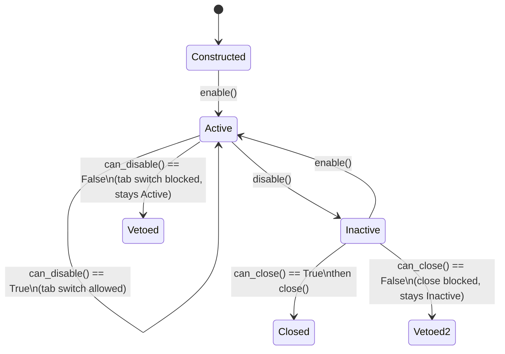

# Base tab runtime contract

`amulet_map_editor.api.framework.base_tab.BaseTab` is the minimal lifecycle
contract every notebook page in the desktop shell implements. It is a runtime
contract, not a UI feature: it says nothing about tab strips, docking, pinning,
grouping, or search, and it has no persisted state of its own. Those live in
the separate [Tabs and groups](../tab-groups/README.md) feature, which projects
a `TabWorkspace` on top of whatever pages this contract produces. This article
covers only the base tab runtime: what a page must implement, when the shell
calls each method, who owns what, how it fails, and how it is verified.

## Who implements it

`BaseTab` has two direct subclasses:

- `amulet_map_editor.api.framework.pages.base_page.BasePageUI` — adds `menu()`
  for pages that contribute application menu entries (used by `WorldPage` and
  its per-extension children).
- `amulet_map_editor.api.framework.programs.base_program.BaseProgram` — the
  base class for a program extension (for example the Edit program) hosted
  inside a world's tab; also adds `menu()`.

`BaseTab` itself declares no constructor and holds no state — a subclass is
free to be any `wx.Window` (or window-like object) as long as it also honours
this contract. The shell that drives it, `AmuletApp`/`AmuletUI`
(`amulet_map_editor/api/framework/amulet_ui.py`) and the world-level notebook
`WorldPage` (`amulet_map_editor/api/framework/pages/world_page.py`), treats
every open page as a `BaseTab` regardless of its concrete class.

## The five methods

| Method | Default | Called by the shell to... |
| --- | --- | --- |
| `enable()` | no-op | Tell the tab it is now the visible/active page. |
| `can_disable() -> bool` | `True` | Ask, before switching away, whether the tab may be deactivated right now. |
| `disable()` | no-op | Tell the tab it is no longer the visible/active page. |
| `can_close() -> bool` | `True` | Ask, before destroying the tab, whether it is safe to close. Must notify the user itself if it intends to return `False`. |
| `close()` | no-op | Tell the tab to release everything it owns; called once, right before the tab object is discarded. |

None of the five methods take arguments or return anything but a bool where
noted. A subclass overriding `enable`/`disable`/`close` should normally chain
to `super()` first (see `edit_canvas.py`'s pattern of calling
`super().enable()` before doing its own renderer/tool setup) so that any
future shared behaviour BaseTab grows is not silently skipped.

## Lifecycle

1. **Construction.** The owning notebook (`WorldPage` for a program extension,
   `AmuletUI` for a top-level world page) constructs the tab and adds it as a
   notebook page. `BaseTab` itself does not run any lifecycle method at
   construction time — a tab is not `enable()`d just because it exists. Both
   real subclasses build their live state (canvas, renderer, tool manager,
   OpenGL context) in `__init__`, since a page can be constructed and sit in
   the background before ever becoming the selected tab.
2. **Activation.** When the notebook's selection changes to this page, the
   shell's `_page_changed` handler (in both `world_page.py` and
   `amulet_ui.py`) calls `enable()` on the newly current page. A page that
   holds any per-frame or per-render work (see `BaseEditCanvas.enable()`)
   starts that work here, not in `__init__`, so background tabs never spend
   CPU or GPU time they cannot show.
3. **Deactivation.** Before the notebook selection actually changes, the shell
   fires a `_page_changing` (`EVT_BOOKCTRL_PAGE_CHANGING`-class) event and asks
   the *currently selected* page's `can_disable()`. Returning `False` vetoes
   the tab switch outright — the notebook selection does not move. Only after
   the switch is allowed does the shell call `disable()` on the old page, then
   `enable()` on the new one. `can_disable()`/`disable()` are the shell's only
   hook for "the user is about to look away from this tab, and it needs to
   pause or release something before that happens" (canvas rendering, an
   OpenGL context that must not run unfocused, and so on).
4. **Teardown.** Closing a tab is a two-step handshake, never a single call:
   the shell asks `can_close()` first, and only calls `close()` if that
   returned `True`. `can_close()` is where a tab may need to warn the user
   (an unsaved-changes prompt, for example) and abort the close by returning
   `False` — the docstring on `BaseTab.can_close()` requires the tab to do its
   own notification, because the shell will not know why the close was
   refused. `close()` itself must be safe to call exactly once, must not
   raise, and must fully release everything the tab owns (OpenGL resources,
   background threads, file handles) since the tab object is discarded right
   after. `WorldPage.close()` shows the pattern for propagating this to
   children: it calls `close()` on every hosted extension page before closing
   the underlying world.

`WorldPage` is itself a `BaseTab` (via `BasePageUI`) that also owns a nested
notebook of program-extension `BaseTab`s. It composes the contract rather than
special-casing it: `WorldPage.can_close()` is `all(page.can_close() for page
in ...)` over its own children, and `WorldPage.enable()`/`disable()` forward to
whichever child page is currently selected. A tab implementor does not need to
know whether it is hosted directly by `AmuletUI` or nested inside a
`WorldPage` — the same five methods are called either way.

## Ownership: shell vs. tab

- **The shell owns:** page construction and destruction (`AddPage`/
  `DeletePage`), notebook selection state, deciding *when* to call each
  lifecycle method, translating a `can_disable()`/`can_close()` refusal into a
  vetoed wx event, and any application-level chrome (menu, tab rail, studio
  viewport hosting) that reacts to a tab becoming active or closing.
- **The tab owns:** everything about its own content — rendering state,
  background work, unsaved-changes tracking, and the decision of whether it is
  currently safe to leave or destroy. The shell never inspects a tab's
  internals to make that decision; it only ever calls `can_disable()`/
  `can_close()` and trusts the answer.
- A tab must not call the shell's page-management methods (`AddPage`,
  `DeletePage`, `SetSelection`) from inside its own lifecycle methods — doing
  so re-enters the notebook while it is mid-transition. `WorldPage._enable_page`
  instead reacts to a failure by calling `DeletePage` on itself from the
  *shell* side, after catching the exception from the child's `enable()`.

## Failure modes

- **`enable()` raises.** Both call sites (`world_page.py`'s `_enable_page` and
  the shell's own `_page_changed` in `amulet_ui.py`) run `enable()` inside the
  page-changed handler. `WorldPage._enable_page` explicitly catches any
  exception, logs it at `critical`, shows a non-blocking exception notice, and
  removes the offending page with `DeletePage` rather than leaving the shell
  in a half-activated state. A tab that cannot safely raise partway through
  `enable()` should catch its own recoverable errors and leave itself in a
  usable (if degraded) state instead of relying on this fallback.
- **`disable()` raises.** `WorldPage._disable_page` catches and logs at
  `critical`, then continues — the tab switch is not aborted because the
  outgoing page failed to tidy up. A tab should treat `disable()` as
  best-effort cleanup it cannot depend on completing before the next
  `enable()` on the same tab.
- **`can_disable()`/`can_close()` returning `False` and never explaining why.**
  `can_close()`'s docstring requires the tab to notify the user itself before
  refusing; a tab that returns `False` silently produces a UI that appears to
  ignore the close request with no feedback. This is a defect in the tab
  implementation, not the shell.
- **`close()` running twice, or running for a tab that was never `disable()`d.**
  Both are contract violations a tab must be defensive against — a `close()`
  that is not idempotent, or that assumes `disable()` already ran, is the
  usual source of a use-after-free style crash in the OpenGL/canvas layer.
  The shell's own call sites always call `disable()` immediately before
  `close()` (`amulet_ui.py`'s `_on_page_closing`), so a tab may rely on that
  ordering, but must not rely on `close()` never being reached twice if a
  future call site changes.
- **A tab that never becomes the selected page.** Because nothing in
  `BaseTab` runs at construction, a tab that is added but never selected (for
  example, a background world tab) legitimately never receives `enable()`
  before `close()`. `close()` must be able to release cleanly regardless of
  whether `enable()` ever ran.

## What this contract deliberately does not cover

- Tab strip position, docking edge, pinning, grouping, and the four
  tab-discovery searches — see [Tabs and groups](../tab-groups/README.md) for
  the reusable `TabWorkspace` state and search contract layered on top of
  whatever `BaseTab` pages exist.
- Persistence of which tab was active, or of tab order — also owned by the
  tab-groups feature.
- Per-tab appearance customization (fonts, colors) — owned by the appearance
  editor, not this runtime contract.
- Menu contribution beyond the `menu()` hook added by `BasePageUI`/
  `BaseProgram` — `BaseTab` itself has no menu concept.

## Verification

- `tests/test_studio_runtime_render_contract.py` exercises the runtime shell
  (`AmuletUI` construction and page-notebook wiring) that drives real
  `BaseTab` subclasses end to end, and is the indirect coverage this contract
  previously relied on exclusively.
- `tests/test_base_tab_runtime_contract.py` is the dedicated contract test: it
  asserts the exact five-method surface (name, default return value, and
  default no-op behaviour) directly against `BaseTab`, verifies that
  `BasePageUI` and `BaseProgram` both subclass `BaseTab` and add only
  `menu()`, and verifies the `can_disable()`/`can_close()` veto-before-mutate
  ordering by using a minimal fake page that records call order under
  `WorldPage`-style disable/close driving logic.
- Any new `BaseTab` subclass should add a construction+lifecycle case here
  rather than relying solely on the broader runtime render contract, so a
  regression in the five-method contract itself fails close to its cause.

## Suggested articles

- [Tabs and groups](../tab-groups/README.md) — the persisted tab-strip state,
  docking, pinning, grouping, and four-search contract layered on top of the
  `BaseTab` pages this article describes.
